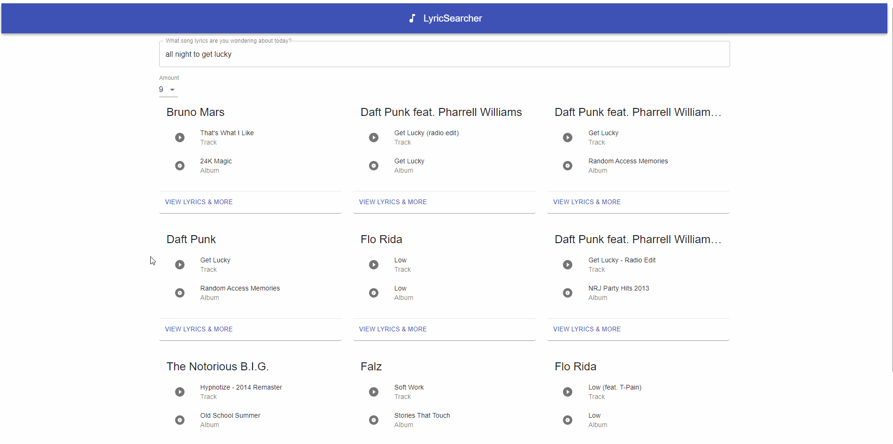

This project was bootstrapped with [Create React App](https://github.com/facebook/create-react-app).

## LyricSearcher

LyricSearcher is an app designed to fetch lyrical data from the MusixMatch API and translate the search experience into an interactive walkthrough a song.

This app was map possible by Create React App and Material-UI.

### Important Info

If you are planning to deploy this app, rename the `.env.sample` file to `.env` and change the line `REACT_APP_API_KEY=<your Musixmatch api key here>`.

Failure to do so will prevent the app from functioning properly.

### Home

On page load, the first page that loads is a home page with a search box, a quantity selector, and a progress spinner.

Upon sucessful fetch of data, the spinner will be replaced with a grid of cards that represent the top hits in card format with artist, track, and album.

### Search

The search box at the top allows you to search for lyrics and have the results automatically update after a short delay. Changing the amount of cards also re-fetches the data.

### Song Information

On every card result, a button labeled `View Lyrics & More` is present.

Clicking on that button will re-route the page to a personalized info page for that track where (30% of the) lyrics, as well as ID, relative popularity, genres, etc. are present.

Use the `Go Back` button to return to the home page and continue browsing.

